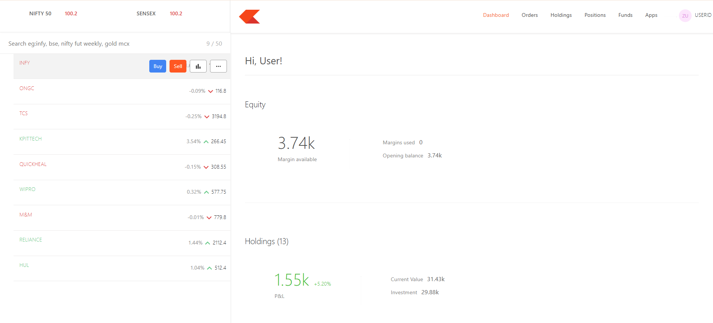

# 💹 Stock Portfolio Dashboard

A modern, responsive **Stock Portfolio Dashboard** built using **React.js** and **Bootstrap**, inspired by real-world trading interfaces.  
It allows users to monitor market indices, view holdings, check portfolio balance, and analyze real-time equity data — all in one clean and interactive interface.

---

## 🚀 Features

- 📈 **Live Indices Overview**
  - Displays NIFTY 50 and SENSEX updates at the top.
  - Real-time or mock data for tracking index performance.

- 💼 **Equity Section**
  - Shows total available margin, margins used, and opening balance.

- 📊 **Holdings Overview**
  - Displays current P&L (Profit & Loss) with percentage change.
  - Tracks total investment, current value, and growth percentage.
  - Lists individual holdings with price change indicators (up/down arrows).

- 🔍 **Search Functionality**
  - Search stocks or symbols (e.g., *INFY*, *TCS*, *ONGC*, etc.).

- 🧭 **Navigation Bar**
  - Easy access to Dashboard, Orders, Holdings, Positions, Funds, and Apps.

- 💎 **Minimal UI**
  - Designed with a light theme for a clean and professional experience.

---

## 🛠️ Tech Stack

| Technology | Purpose |
|-------------|----------|
| **React.js** | Frontend UI rendering |
| **Bootstrap 5** | Styling and responsive layout |
| **React Router** | Navigation and routing |
| **Axios / Fetch API** | For API integration (mock or live) |
| **Chart.js / Recharts (optional)** | For visual portfolio analytics |

---

### 🖼️ Screenshot / Preview



---

### 1️⃣ Clone the Repository
```bash
git clone https://github.com/Vaibhav-Pacherwal/Stock-Trading-Platform-Dashboard
```

### 2️⃣ Install Dependencies
```bash
npm install
```

### 3️⃣ Run the Project
```bash
npm start
```